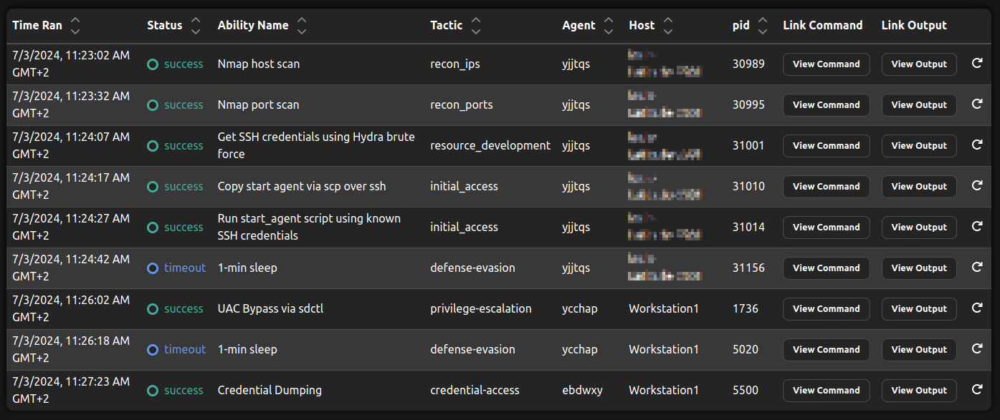

# The Bounty Hunter

The Bounty Hunter is a custom Caldera Plugin developed and implemented by Fraunhofer FKIE.
The biggest asset of the Bounty Hunter Plugin is the new Bounty Hunter Planner that allows the emulation of complete, realistic cyberattack chains - including autonomous initial access and privilege escalation methods.
The attack behavior of an emulated adversary using the Bounty Hunter Planner has two special properties:
First, it is goal-oriented and reward-driven, similar to the Look-Ahead Planner, and second, it is variable due to weighted-randomness in its decision process.
Furthermore, configurable ability reward updates during a running operation allow more complex and realistic attack chains.

Notes:
- The initial access phase of the Bounty Hunter can be skipped by assigning the initial agent to the group `target`.
- Initial Access and privilege escalation methods are only implemented as "weak" proof of concept for Windows and Linux targets.

# Emulating complete, realistic Cyberattacks with the Bounty Hunter

## Initial Access and Privilege Escalation Demonstration
The following section describes how to emulate a complete, realistic cyberattack chain using the Bounty Hunter.
To run an operation,  start the Caldera server as usual.
As starting point, the Bounty Hunter uses a local Caldera agent, i.e., an agent that is running on a system initially controlled by the adversary.
Since some initial access abilities, e.g., the Nmap Port Scan (`8fcd3afb-75ca-40da-8bff-432abfb00fbb`), need root privileges, start the local agent with root/sudo. 
The `Bounty Hunter Windows Initial Access and Privilege Escalation Tester` adversary and the Bounty Hunter's default configuration (`data/planners/e1bb9388-1845-495d-b67b-ad61a31ff6cd.yml`) were constructed to demonstrate the initial access and privilege escalation capabilities against a Windows or Linux target.

Before running the operation, some configurations have to be done:
1. Configure fact `bountyhunter.ip_range`: Using the Caldera UI, configure the IP address range the bounty hunter should scan initially.
2. Put the username and password of a user on the target machine into `files/wordlists/passwords.txt` and `files/wordlists/users.txt` so that Hydra can successfully brute force the ssh credentials.
3. Check if the payloads in the payloads directory are unzipped.
4. Configure the IP address of the Caldera server in the initial access payload scripts, i.e., `start_agent_from_linux_target.sh` and `start_agent_from_windows_target.ps1`.

For Linux Target:

Edit sudoers file so that user whose credentials are gathered using the ssh brute force can execute `sudo /bin/bash` without password (see example for metasploitable3 below). This is the weak configuration used for the privilege escalation.
```
(...)

# Add weak configuration
jarjar_binks ALL=(ALL) NOPASSWD: /bin/bash
```

For Windows Target:
1. Update Caldera host in payload `bypassUAC.ps1`: Since this script starts a new Caldera agent that connects to the Caldera server, the IP address and port of the Caldera server have to be configured here. More information in the payload itself.
2. Update IP address value in payload `credDump.ps1`: Since this script downloads mimikatz from the Caldera server, the IP address and port of the Caldera server have to be configured here. More information in the payload itself.
3. Log in as the user we want to compromise so that the scheduled task will be executed during initial access.
4. Set up a Windows target with SSH enabled and set UAC to `Never Nofify`. Also disable Antivirus/Microsoft Defender (especially Real-time protection) since Caldera does not work with them running.


After performing the configuration steps, a new operation can be started using the Bounty Planner and the demo adversary profile.
The expected results are shown in the figure below.
The operation should start with a Nmap host scan, followed by a Nmap port scan of the found IP addresses.
Since the Bounty Hunter found an open SSH port on the Windows machine, it decides to brute force the credentials.
With the found credentials, the `start_agent_from_windows_target.ps1` script is copied to the target via ssh/scp and executed using a scheduled task.
At this moment, the initial access step is done and the Bounty Hunter successfully started a new agent on the target.
Now, since the ability `Credential Dumping` (`a440211a-d2cc-4f89-a02d-a39061a0e697`) requires elevated privileges, the planner enters the privilege escalation phase.
Here a new agent is started using `UAC Bypass via sdctl` (`0220b3e7-9ba0-4529-abb4-52a70dc49b50`).
With the new agent, the Bounty Hunter can execute its goal ability: `Credential Dumping` (`a440211a-d2cc-4f89-a02d-a39061a0e697`).
Note how you can see the Bounty Hunter using the three different agents during the operation.



## Emulating an APT29 Campaign

The Bounty Hunter Planner was tested using the APT29 Day 2 data from the [adversary emulation library](https://github.com/center-for-threat-informed-defense/adversary_emulation_library/) of the Center for Threat Informed Defense.
The resulting attack chain including fact-links between abilities is shown in the figure below.
The test showed that the Bounty Hunter is able to initially access a Windows Workstation using SSH Brute Force, elevate its privileges automatically using a Windows UAC Bypass and finally compromise the whole domain using a Kerberos Golden Ticket Attack.
(Note: the attack steps are NOT part of the plugin but are included in the adversary emulation library!)
To achieve its goal, the planner was only provided with an adversary profile that includes all Caldera abilities in no certain order (including the APT29 Day 2 abilities), a high reward value of the final ability that executed a command using the Golden Ticket, and the name of the interface to scan initially.
All other information needed for the successful execution, including the Domain Name, Domain Admin Credentials, SID values, and NTLM hashes, were collected autonomously.


# Deltas to existing Caldera Planners

Since the Bounty Hunter seems very similar to existing Caldera planners, e.g., the Look Aheader planner, this section describes the differences between them in more detail.

- **Support for Initial Access and Privilege Escalation.** 
At the moment, no Caldera planner offers support for Initial Access or Privilege Escalation methods.
The Bounty Hunter extends Caldera's capabilities by offering support to both in a fully autonomous manner.

- **Weighted-Random Attack Behavior.**
The Bounty Hunter offers the possibility to pick the next ability to execute weighted-randomly based on the abilities' future reward values.
This adds an uncertainty to the planners behavior which allows repeated runs of the same operation with completely different results.
This might be very useful for training environments.

- **Further Configurations for more sophisticated and realistic Attack Behavior.**
The various configurations that are possible using the Bounty Hunter, e.g., "locking" abilities, reward updates, and final abilities, allow a plethora of possible attack behaviors.
One examples is given above, in the section "Locked Abilities and Manual Reward Updates".

# Installation

- Download the plugin
- Copy the `bountyhunter` directory into `caldera/plugins` and enable the plugin in the Caldera server's configuration (`caldera/conf/<config>.yml`)
- Install requirements: `pip install -r requirements.txt`
- Unzip `caldera/plugins/bountyhunter/payloads/payloads.zip` to `caldera/plugins/bountyhunter/payloads`

# Bounty Hunter Configuration

The Bounty Hunter's can be configured in many ways to further customize the emulated attack behavior.
The configuration can be viewed and edited in `bountyhunter/data/planners/e1bb9388-1845-495d-b67b-ad61a31ff6cd.yml`.
Furthermore, the configuration is displayed in the Bounty Hunter's user interface tab (`plugins -> bountyhunter`).
The configuration can also (partially) be edited using the user interface after pulling [this Caldera branch](https://github.com/L015H4CK/caldera/tree/feature-api-update-planner), which allows updating existing planners using Caldera's API.

The following table lists the various parameters used by the Bounty Hunter including a short description and the default values.

| Parameter             | Description                                                                                                                                                                                                                  | Default Value |
|-----------------------|------------------------------------------------------------------------------------------------------------------------------------------------------------------------------------------------------------------------------|---------------|
| weighted_random       | Enables/disables weighted random attack behavior. If enabled, the next ability to execute is picked weighted-randomly depending on the abilities' reward values. If disabled, the ability with the highest reward is picked. | False         |
| seed                  | Specifies the seed value to use for random decisions during the weighted-random attack behavior as well as the initial access and privilege escalation phases. Allows reproduction.                                          | None          | 
| discount              | Discount factor for future reward calculation.                                                                                                                                                                               | 0.9           |
| depth                 | Recursive depth for future reward calculation.                                                                                                                                                                               | 3             |
| default_reward        | Default reward value for all abilities.                                                                                                                                                                                      | 1             |
| default_final_reward  | Default reward value for all final abilities. Should be larger than the default_reward, so that the planner tries to pursuit them (more likely).                                                                             | 1000          |
| default_reward_update | Default reward update value. After executing an ability all "following" abilities' (i.e., abilities that require facts that are collected by the executed ability) reward values are increased by this value.                | 200           |
| final_abilities       | List of final ability IDs. Operation stops when one of those abilities is executed.                                                                                                                                          | None          |
| locked_abilities      | List of locked ability IDs. These abilities will not be executed until they are "unlocked" by increasing their ability reward.                                                                                               | None          |
| ability_rewards       | List of ability IDs and corresponding reward values. Allows further attack behavior customization.                                                                                                                           | None          |
| reward_updates        | List of custom reward update values per ability ID. Allows further attack behavior customization and "unlocking" abilities that are not logically (i.e., by facts) connected.                                                | None          |


# Future Reward Calculation

The future reward calculation is performed in the same way as in the look ahead planner.
It uses ability rewards (configured using the various ability reward parameters above) as well as the discount and depth parameters.
The ability rewards are directly used during the anticipated future reward calculation.
How far, i.e., how many abilities ahead, the Bounty Hunter uses ability rewards is controlled by the depth parameter while the discount factor controls how much influence future ability reward values have on the calculation.

# Locked Abilities and Manual Reward Updates

Locking abilities and performing manual reward updates enables the Bounty Hunter to perform more realistic, more sophisticated and customized attacks.
Consider the example adversary `Bounty Hunter - Locked Abilities Demonstrator` with the following abilities: `Find files`, `Stage sensitive files`, `Create staging directory`, `Compress staged directory`, and `Exfil staged directory`.
Also, the ability `Exfil staged directory` has a high reward value, e.g., `1000`.
When using Caldera's look ahead planner, the agent will execute the following attack chain:
- Create staging directory
- Compress staged directory
- Exfil staged directory
- Find files (x3)
- Stage sensitive files (for each found file)
- (...)

This results in an empty directory being exfiltrated because it is the "shortest path to the goal" since it follows the highest future reward values.
Now, the Bounty Hunter can be configured to "lock" the `Compress staged directory` ability and only "unlock" it by executing the ability `Stage sensitive files`.
This means, it will only compress the staged directory after files have been staged. See example configuration below.

```
params:
  final_abilities:
    - ea713bc4-63f0-491c-9a6f-0b01d560b87e        # exfiltrate staged directory
  locked_abilities:
    - 300157e5-f4ad-4569-b533-9d1fa0e74d74        # compress staged directory
  reward_updates:
    4e97e699-93d7-4040-b5a3-2e906a58199e:         # stage sensitive files
      300157e5-f4ad-4569-b533-9d1fa0e74d74: 1     # compress staged directory
```

Now, when running an operation using the Bounty Hunter and the above configuration, the following attack chain is generated and executed:
- Create staging directory
- Find files (3x)
- Stage sensitive files (3x)
- Compress staged directory
- Exfil staged directory

As we can see, the resulting attack chain is more sophisticated and more realistic because the exfiltrated directory is not empty.
Furthermore, the planner automatically stops the operation after executing the goal ability, compared to the Look Ahead that continued with collecting and staging files after already exfiltrating.

# Initial Access Agendas

Initial Access Agendas are predefined ability chains that the Bounty Hunter uses during the Initial Access phase.
After scanning the potential targets, the agendas help the planner decide how to continue the operation.
Defining the agendas as ability chains allows more sophisticated scenarios than using the "classic" Caldera approach of using facts and requirements.
Also, during the Initial Access phase, the attacker's behavior should be more straight-forward instead of simply adding all abilities to the current adversary and letting the planner decide which ability to execute based on facts and requirements.
Each agenda should have the goal to start a new Caldera agent on the target machine.

## Agenda Configuration
Agendas are defined in `bountyhunter/conf/agenda_mapping.json`.
Each agenda has a name, requirements and a list of ability IDs.
An agenda is considered "valid" if all its requirements are met.
At the moment, options for requirements are port, service_info and version_info, i.e., the facts gathered during the port scanning phase and parsed by the nmap parser.

The following example agenda implements an SSH Brute Force Attack using Hydra.
As requirements, the target host must have an open port 22.
Three abilities are added to the running operation and executed:
1. `Get SSH credentials using Hydra brute force`: Uses Hydra and custom wordlists containing usernames and passwords to use.
2. `Copy start agent via scp over ssh`: Copies the `start_agent` script to the target machine using the gathered SSH credentials.
3. `Run start_agent script using known SSH credentials`: Executes the copied script in order to start a new Caldera agent.

```
{
  "agendas": [
    {
      "name": "ssh bruteforce linux/windows",
      "requirements": {
        "port": "22"
      },
      "ability_ids": [
        "85d6ce79-07ea-4ed4-b763-8a6f7d5591d7",
        "6a49e8f3-0c00-436e-a848-06de496a942f",
        "099ea47f-fa4d-4c2e-a089-601eefecb962"
      ]
    }
  ]
}
```

To add a new agenda, implement the respective abilities, e.g., for exploiting a known vulnerability, and create a new entry in the `agendas` list.
Then, add the ability IDs, a name, and the requirements.
The Bounty Hunter will autonomously decide if an agenda is valid and will consider executing it during the Initial Access phase.
