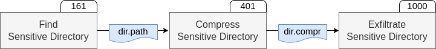
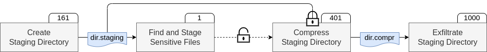

# Autonomous, reward-driven planning

To make it easy for users and save time in preparing assessments, Bounty Hunter doesn’t require pre-written playbooks or detailed information about the target system.
It autonomously pursues user-defined goals utilizing ability facts and requirements and reward-driven decisions.
Furthermore, it allows for automatic (un)locking of abilities and real-time reward updates.
This lets it simulate attackers with different goals (like maintaining access before stealing files) and ensures abilities are executed in a specific order, even if they aren’t logically linked via facts and requirements.
Next, we’ll explain how Bounty Hunter's design allows its autonomous, reward-driven planning.

## Linking abilities via facts and requirements
To eliminate the need of predefined playbooks, Bounty Hunter autonomously links abilities using their gathered facts and requirements, i.e., their pre- and post-conditions.
Two abilities are linked when one ability `a2` requires a fact that is gathered by another ability `a1`.
In such a case, we also call `a2` a _following_ ability of `a1`.

Consider the example below.
Here, the ability _Compress Sensitive Directory_ follows _Find Sensitive Directory_ because it requires the fact `dir.path` which is gathered by the latter.

[](../../assets/linked-steps.png)

## Reward-driven decision making
To keep user input simple, Bounty Hunter focuses on defining goals. 
Bounty Hunter utilizes links between abilities and their reward values to predict future rewards for all abilities.
To achieve the defined goal, it iteratively chooses the ability with the highest future reward without unmet requirements.
Rewards are assigned in two ways: (1) abilities defined as goals get a high reward automatically, and (2) users can set custom rewards for specific abilities.
Bounty Hunter uses a finite-horizon discount model to calculate future rewards for abilities, adding the ability’s reward to the best discounted rewards of the following abilities.
The discount factor `g` reduces the importance of rewards further down the sequence, with a set maximum depth `d` for consideration.

The future reward calculation is performed in the same way as in Caldera's Look-Ahead Planner.
The formula for the future reward calculation is: `f(a,d) = r(a) × g^d + max(f(a.following, d+1))`, with the parameters:
- `r(a)`: reward of ability `a`
- `g`: discount factor
- `d`: depth parameter
- `a.following`: following abilities of `a`

Consider the example above.
_Exfiltrate Sensitive Directory_ has a high reward of 1000 as it is the configured goal ability.
Accordingly, _Compress Sensitive Directory_ gets a reward of 401 and _Find Sensitive Directory_ a reward of 161.

## Locking and unlocking abilities

When relying solely on conditions and reward-driven decision making, unrealistic and undesirable ability sequences could be generated.
For example, when given the goal to exfiltrate sensitive files, Bounty Hunter's Look Ahead Planner might strictly execute abilities to gather information needed for its goal, resulting in an empty directory being exfiltrated.
To avoid this, some abilities need to be executed in a specific order, even if they aren’t logically linked via conditions.
To ensure that certain abilities aren’t executed prematurely, Bounty Hunter allows users to define an ability as locked, which prevents its execution until it is unlocked by successfully executing another specified ability.
In the example below, we defined the ability _Compress Staging Directory_ as locked, and it will automatically unlock after executing _Find and Stage Sensitive Files_, ensuring that the staging directory isn’t empty when compressing and exfiltrating it.

## Updating reward values
Real-life adversaries often carry out attacks where not all of their abilities are aimed at the same goal.
For example, APT29 is known for establishing persistence on their target before exfiltrating sensitive data.
Bounty Hunter supports the emulation of adversaries with such intermediate goals by allowing users to set up automated reward increases (or decreases) based on executed abilities.
In the APT29 example, users can configure Bounty Hunter to automatically increase the reward for the exfiltration ability after successfully executing the ability that establishes persistence.
This shifts the focus of its reward-driven decision making toward the exfiltration ability.
Additionally, not all abilities relevant to an attack need to be logically linked to the goal.
For instance, finding and staging sensitive files before compressing and exfiltrating the staging directory is a common scenario.
To help emulate adversaries progressing through the attack lifecycle, Bounty Hunter automatically increases the rewards for all abilities that follow the last successfully executed ability, encouraging a natural flow of executed abilities.

## Example
Consider the example below.
The ability _Exfiltrate Staging Directory_ is defined as goal and _Compress Staging Directory_ as locked.
Since all abilities with a higher future reward value have unfulfilled pre-conditions, Bounty Hunter first executes _Create Staging Directory_.
After successfully executing this ability, it automatically increases the reward values of all following abilities by a default of 100, thus increasing _Compress Staging Directory_’s future reward to a total of 501 and _Find and Stage Sensitive Files_’s future reward to 101.
Since the ability _Compress Staging Directory_ is still locked, Bounty Hunter plans to execute _Find and Stage Sensitive Files_ next, driven by its increased reward value.
Upon successful execution, the ability _Compress Staging Directory_ is unlocked and subsequently executed.
At this point, the goal ability has its pre-condition fulfilled and Bounty Hunter can execute it, concluding the assessment.

[](../../assets/locked-steps.png)

```yaml
name: Locked Ability Demo Scenario
description: Use with adversary profile "Bounty Hunter - Demo Adversary Profile" or 
  "Bounty Hunter - Locked Abilities Demonstrator" and an agent running on the 
  target machine in group "target".
final_abilities:
  - ea713bc4-63f0-491c-9a6f-0b01d560b87e           # exfiltrate staged directory
locked_abilities:
  - 300157e5-f4ad-4569-b533-9d1fa0e74d74            # compress staged directory
reward_updates:
  4e97e699-93d7-4040-b5a3-2e906a58199e:             # stage sensitive files
    300157e5-f4ad-4569-b533-9d1fa0e74d74: 1         # compress staged directory
```