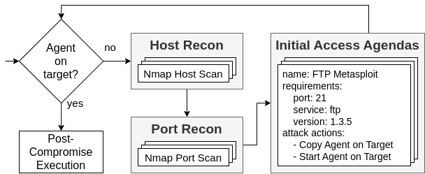
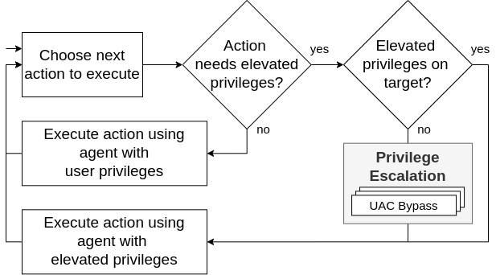

# Coverage of additional tactics

Adversary emulation should cover a wide range of TTPs (Tactics, Techniques, and Procedures).
We designed Bounty Hunter as a plugin for Caldera to utilize its extensive library of techniques, which includes over 1,700 abilities covering all post-compromise tactics.
Below, we explain how Bounty Hunter enhances Caldera's capabilities with two dedicated planning components for (pre-)compromise and coherent privilege escalation techniques, allowing for the emulation of adversaries across pre-, initial, and post-compromise tactics.

## (Pre-)compromise

Many adversary emulation methods focus mainly on post-compromise tactics, often overlooking (pre-)compromise techniques.
Bounty Hunter’s planning logic for (pre-)compromise, including Reconnaissance and Initial Access, starts with a dedicated C2 agent on an adversary-controlled system.
This agent simulates reconnaissance techniques like network and system scans to collect information on reachable hosts, open ports, and running services (e.g., using Nmap).
With this information, Bounty Hunter identifies and exploits known vulnerabilities using pre-configured initial access agendas - i.e., short, user-defined ability sequences designed to compromise a target under specific conditions.
It then compromises the target by launching a new C2 agent on it and continues with post-compromise abilities.

## Privilege escalation
Real-world adversaries often change execution contexts during their attacks, like starting an elevated session from a user-level session.
However, many approaches (including Caldera) emulate incoherent attacks, executing abilities in the emulator’s context rather than in one another’s, especially during privilege escalation.
Bounty Hunter emulates privilege escalation coherently through a dedicated planning component.
During an assessment, it checks if the next ability requires elevated privileges.
If it does and no elevated agent has been started on the target, Bounty Hunter autonomously executes a privilege escalation technique to launch a new elevated agent.
After successfully starting this new agent, it resumes executing the ability that requires elevated privileges using the new elevated agent.

