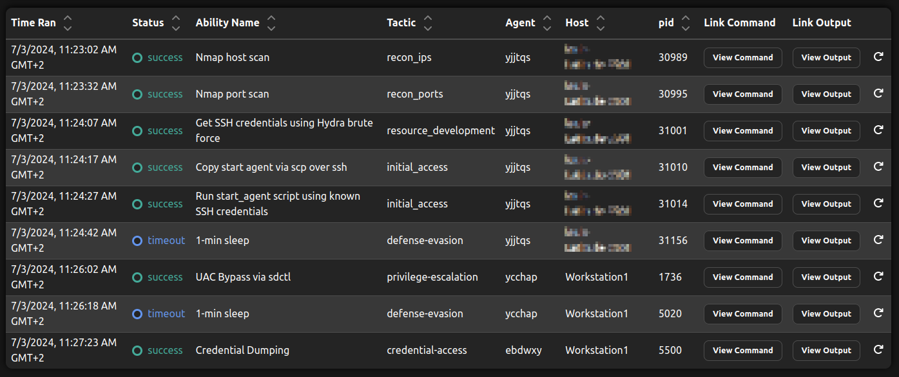

# Initial Access and Privilege Escalation

The following example describes how to emulate a complete, realistic cyberattack chain using Bounty Hunter and can be used as a guide for getting started with it.
To run an operation,  start the Caldera server as usual.
As starting point, Bounty Hunter uses a local Caldera agent, i.e., an agent that is running on a system initially controlled by the adversary.
Since some initial access abilities, e.g., the _Nmap Port Scan_ (`8fcd3afb-75ca-40da-8bff-432abfb00fbb`), need root privileges, start the local agent with root/sudo.
To run this scenario, select `demo_initial_access_and_priv_esc` in Bounty Hunter's UI tab or configure the scenario in the configuration file (`data/planners/e1bb9388-1845-495d-b67b-ad61a31ff6cd.yml`).
The scenario's defined goal abilities aim to collect credentials on Linux and Windows targets, respectively, and require elevated privileges to run.
The adversary profile _Bounty Hunter Windows Initial Access and Privilege Escalation Tester_ was constructed to demonstrate the initial access and privilege escalation capabilities against a Windows or Linux target.
Alternatively, the _Bounty Hunter - Demo Adversary Profile_ can be used as well - which includes all demo abilities for Bounty Hunter and can be used to demonstrate the various behaviors controlled by the scenario configurations.

## Setup

Before running the operation, some setup steps have to be done:
1. Configure fact `bountyhunter.ip_range`: Using the Caldera UI, configure the IP address range Bounty Hunter should scan initially. This is the only information Bounty Hunter is provided with.
2. Put the username and password of a user on the target machine into `files/wordlists/passwords.txt` and `files/wordlists/users.txt` so that Hydra can successfully brute force the ssh credentials.
3. Check if the payloads in the payloads directory are unzipped.
4. Configure the IP address of the Caldera server in the initial access payload scripts, i.e., `start_agent_from_linux_target.sh` and `start_agent_from_windows_target.ps1`.

For Linux Target:

Edit sudoers file so that the user whose credentials are gathered using the ssh brute force can execute `sudo /bin/bash` without password (see example for metasploitable3 below).
This is a known weak configuration that will be used for the privilege escalation.
```
(...)

# Add weak configuration
jarjar_binks ALL=(ALL) NOPASSWD: /bin/bash
```

For Windows Target:
1. Update Caldera host in payload `bypassUAC.ps1`. Since this script starts a new Caldera agent that connects to the Caldera server, the IP address and port of the Caldera server have to be configured here. More information in the payload itself.
2. Update IP address value in payload `credDump.ps1`. Since this script downloads mimikatz from the Caldera server, the IP address and port of the Caldera server have to be configured here. More information in the payload itself.
3. Set up a Windows target with SSH enabled and set UAC to `Never Nofify`. Also disable Antivirus/Microsoft Defender (especially Real-time protection) since Caldera does not work with them running.
4. Log in as the user we want to compromise so that the scheduled task will be executed during initial access.

## Operation results

After performing the configuration steps, a new operation can be started using the Bounty Planner and one of the demo adversary profiles.
The expected results are shown in the figure below.
The operation starts with a Nmap host scan, followed by a Nmap port scan of the found IP addresses.
Since Bounty Hunter found an open SSH port on the Windows machine, it decides to brute force the credentials.
With the found credentials, the `start_agent_from_windows_target.ps1` script is copied to the target via ssh/scp and executed using a scheduled task.
At this moment, the initial access step is done and Bounty Hunter successfully started a new agent on the target.
Now, since the ability _Credential Dumping_ (`a440211a-d2cc-4f89-a02d-a39061a0e697`) requires elevated privileges, the planner enters the privilege escalation phase.
Here a new agent is started using _UAC Bypass via sdctl_ (`0220b3e7-9ba0-4529-abb4-52a70dc49b50`).
With the new agent, Bounty Hunter can execute its goal ability: _Credential Dumping_ (`a440211a-d2cc-4f89-a02d-a39061a0e697`).
Note how you can see Bounty Hunter using the three different agents during the operation.

[](../../assets/bountyhunter_example_operation.png)