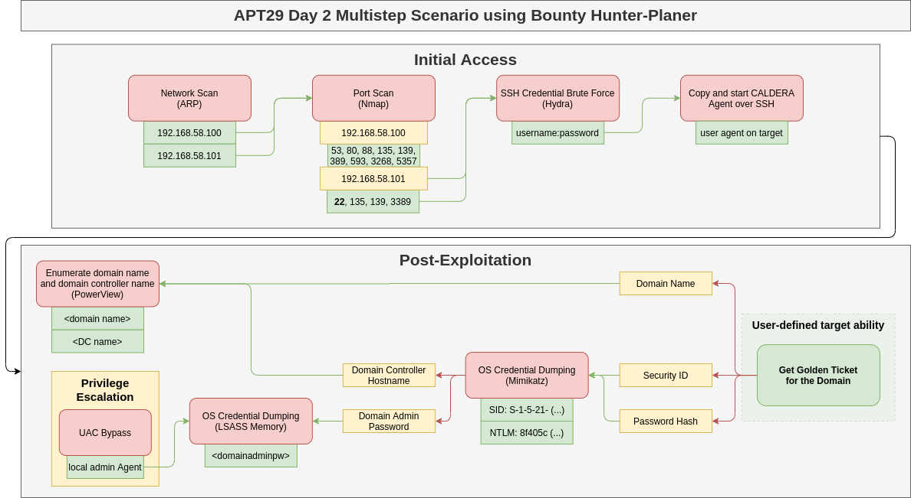

# Emulating an APT29 Campaign

The Bounty Hunter Planner was tested using the APT29 Day 2 data from the [adversary emulation library](https://github.com/center-for-threat-informed-defense/adversary_emulation_library/) of the Center for Threat Informed Defense.
The resulting attack chain including fact-links between abilities is shown in the figure below.

The test showed that Bounty Hunter is able to initially access a Windows Workstation using SSH Brute Force, elevate its privileges automatically using a Windows UAC Bypass and finally compromise the whole domain using a Kerberos Golden Ticket Attack.
To achieve its goal, the planner was only provided with an adversary profile that includes all Caldera abilities in no certain order (including the APT29 Day 2 abilities), a high reward value of the final ability that executed a command using the Golden Ticket, and the name of the interface to scan initially.
All other information needed for the successful execution, including the domain name, domain admin credentials, SID values, and NTLM hashes, were collected autonomously.

**NOTE:** We note that the attack steps of the described APT29 attack are NOT part of this plugin. We only provide this scenario as an example of Bounty Hunter's capabilities.